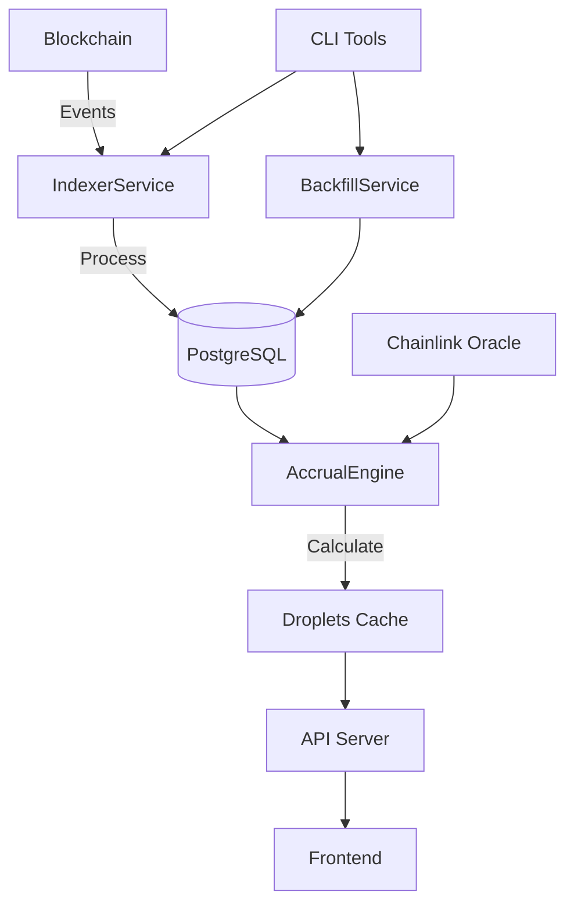

# Stream Droplets Tracker - System Architecture

## Overview

The Stream Droplets Tracker is a production-ready blockchain indexing and points calculation system designed for the Stream Protocol. It tracks user interactions with StreamVault contracts across multiple chains, calculates droplet rewards based on USD exposure, and provides real-time APIs for data access.

## Core Components

### 1. Indexer Service Architecture

#### IndexerService (`src/services/IndexerService.ts`)
- **Purpose**: Core blockchain event indexing engine
- **Features**:
  - Automatic failover between multiple RPC endpoints
  - Configurable retry logic with exponential backoff
  - Event-driven architecture with progress tracking
  - Health monitoring and metrics collection
  - Graceful error recovery

#### IndexerOrchestrator (`src/services/IndexerOrchestrator.ts`)
- **Purpose**: Manages multiple chain indexers
- **Features**:
  - Concurrent multi-chain indexing
  - Automatic indexer restart on failure
  - Centralized monitoring and status reporting
  - Resource management and coordination

### 2. Chain Configuration System

#### Chain Configurations (`src/config/chains.ts`)
- **Purpose**: Centralized chain and vault configuration
- **Structure**:
  ```typescript
  ChainConfig {
    chain: Chain              // viem chain object
    chainId: number           // Network ID
    rpcEndpoints: string[]    // Fallback RPC URLs
    vaults: VaultDeployment[] // Contract addresses and deployment info
    confirmations: number     // Block confirmations required
    retryConfig: {...}        // Retry behavior settings
  }
  ```

### 3. Backfill Service

#### BackfillService (`src/services/BackfillService.ts`)
- **Purpose**: Historical data collection and reconstruction
- **Features**:
  - Configurable block ranges and batch sizes
  - Progress tracking with event emissions
  - Transaction-safe event processing
  - Balance history reconstruction
  - Parallel event fetching

### 4. Accrual Engine

#### AccrualEngine (`src/accrual/AccrualEngine.ts`)
- **Purpose**: Droplet calculation based on USD exposure
- **Algorithm**:
  1. Calculate shares held at round start
  2. Check for unstaking during round (exclusion rule)
  3. Convert shares to USD value using Chainlink oracles
  4. Apply droplet rate per USD per round
  5. Cache results for performance

### 5. API Layer

#### Fastify API Server (`src/api/server.ts`)
- **Endpoints**:
  - `/api/v1/points/:address` - Get droplets for address
  - `/api/v1/leaderboard` - Top addresses by droplets
  - `/api/v1/events` - Recent blockchain events
  - `/api/v1/rounds` - Round information
  - `/api/v1/admin` - Administrative functions
  - `/api/v1/health` - System health status

### 6. CLI Tools

#### CLI Interface (`src/cli/index.ts`)
- **Commands**:
  ```bash
  stream-droplets indexer start    # Start all indexers
  stream-droplets indexer status   # Show indexer status
  stream-droplets backfill run     # Run historical backfill
  stream-droplets db migrate       # Run database migrations
  stream-droplets droplets calculate <address>  # Calculate droplets
  ```

## Data Flow



## Database Schema

### Core Tables

1. **share_events**: All StreamVault events
   - Stake, Unstake, Redeem, InstantUnstake events
   - Indexed by tx_hash and log_index for idempotency

2. **rounds**: Round information with PPS
   - Price per share at round start
   - Yield information

3. **balance_snapshots**: User balances at round boundaries
   - Critical for droplet calculations
   - Tracks unstaking exclusions

4. **droplets_cache**: Calculated droplet values
   - Performance optimization
   - Invalidated on new rounds

5. **excluded_addresses**: Addresses excluded from droplets
   - Vault contracts
   - System addresses

## Production Features

### Reliability
- **Multi-RPC Failover**: Automatic switching between RPC endpoints
- **Retry Logic**: Exponential backoff for transient failures
- **Error Recovery**: Automatic indexer restart on critical errors
- **Transaction Safety**: Database transactions for atomic updates

### Performance
- **Batch Processing**: Configurable batch sizes for optimal throughput
- **Parallel Fetching**: Concurrent event retrieval
- **Caching Layer**: Droplet calculations cached per round
- **Connection Pooling**: Efficient database connection management

### Monitoring
- **Health Checks**: Regular system health monitoring
- **Metrics Collection**: Blocks processed, events indexed, error rates
- **Progress Tracking**: Real-time backfill and indexing progress
- **Event Emissions**: Observable events for external monitoring

### Scalability
- **Horizontal Scaling**: Multiple indexer instances per chain
- **Chain Agnostic**: Easy addition of new chains
- **Modular Architecture**: Independent service components
- **Queue Ready**: Can integrate with message queues

## Deployment

### Environment Variables
```env
# Database
DB_HOST=localhost
DB_PORT=5432
DB_NAME=stream_droplets
DB_USER=postgres
DB_PASSWORD=

# RPC Endpoints
ALCHEMY_API_KEY_1=xxx
ALCHEMY_API_KEY_2=xxx  # Fallback
ALCHEMY_API_KEY_3=xxx  # Fallback

# Contract Addresses
XETH_VAULT_ETH=0x...
XBTC_VAULT_ETH=0x...
# ... more contracts

# Configuration
ETH_CONFIRMATIONS=12
SONIC_CONFIRMATIONS=32
INDEXER_BATCH_SIZE=1000
```

### Production Checklist
- [ ] Configure multiple RPC endpoints for failover
- [ ] Set appropriate batch sizes for chain throughput
- [ ] Configure monitoring and alerting
- [ ] Set up database backups
- [ ] Configure rate limiting on API
- [ ] Set up SSL/TLS for API endpoints
- [ ] Configure log aggregation
- [ ] Set up error tracking (e.g., Sentry)
- [ ] Configure auto-restart policies
- [ ] Set resource limits

## Security Considerations

1. **Input Validation**: All user inputs validated with Zod
2. **SQL Injection Prevention**: Parameterized queries via Knex
3. **Rate Limiting**: API rate limiting per IP
4. **Address Validation**: Ethereum address format validation
5. **Admin Protection**: Admin endpoints require API key
6. **Error Handling**: No sensitive data in error messages

## Testing Strategy

1. **Unit Tests**: Service logic and calculations
2. **Integration Tests**: Database and RPC interactions
3. **End-to-End Tests**: Full indexing and API flow
4. **Load Tests**: Performance under high throughput
5. **Chaos Testing**: Failure recovery scenarios

## Future Enhancements

1. **WebSocket Support**: Real-time event streaming
2. **GraphQL API**: Flexible data queries
3. **Multi-Region**: Geographic distribution
4. **Event Sourcing**: Complete event replay capability
5. **Analytics Dashboard**: Built-in monitoring UI
6. **Webhook System**: Event notifications
7. **Archive Node Support**: Deep historical queries
8. **Cross-Chain Messaging**: Bridge event tracking